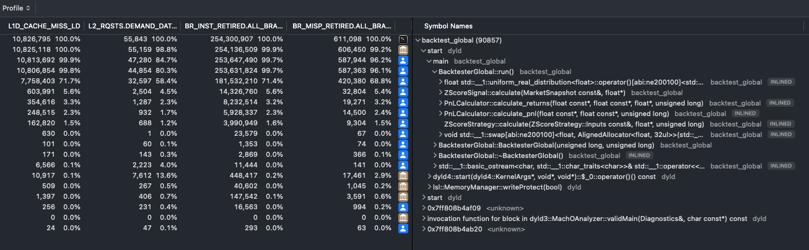

# Performance Analysis

## Table of Contents

- [Part 1: Backtester Benchmark](#part-1-backtester-benchmark)
  - [System Configuration](#system-configuration)
  - [Memory Footprint](#memory-footprint)
  - [CPU Counter Profile](#cpu-counter-profile)
  - [Time Profile Breakdown](#time-profile-breakdown)
  - [Bottleneck Summary](#bottleneck-summary)
  - [Optimization Opportunities](#optimization-opportunities)
- [Part 2: Market Feed Throughput](#part-2-market-feed-throughput)
  - [Architecture Overview](#architecture-overview)
  - [Analysis](#analysis)

---

# Part 1: Backtester Benchmark

> **Source:** `src/main_global.cpp` | **Target:** `BacktesterGlobal::run`
>
> Single-threaded batch processing of historical price data through signal generation and PnL calculation.

## System Configuration
- **CPU**: 12-core @ 2.6 GHz (Intel)
- **L1 Cache**: 32 KB (Data) + 32 KB (Instruction)
- **L2 Cache**: 256 KB per core (x6)
- **L3 Cache**: 12 MB shared
- **Workload**: 2,048 assets x 100,000 time periods

## Memory Footprint

**Target:** `BacktesterGlobal::run > ZScoreSignal::calculate`

```
Per-iteration buffers (hot working set):
├─ prev_prices:  2,048 × 4 bytes = 8,192 bytes
├─ curr_prices:  2,048 × 4 bytes = 8,192 bytes  
├─ returns:      2,048 × 4 bytes = 8,192 bytes
├─ zscores:      2,048 × 4 bytes = 8,192 bytes
└─ signals:      2,048 × 4 bytes = 8,192 bytes
                          Total = 40,960 bytes (40 KB)

RNG state (Mersenne Twister): 624 × 4 bytes = 2,496 bytes

Total hot working set: 42.5 KB
```

Working set (42.5 KB) exceeds L1 cache capacity (32 KB).

## CPU Counter Profile

**Tool:** Apple Instruments (CPU Counters)



### Cache Performance
| Metric | Count | Rate |
|--------|-------|------|
| L1 Data Misses (L1D_CACHE_MISS_LD) | 10,826,795 | — |
| L2 Demand Misses (L2_RQSTS.DEMAND_DATA_RD_MISS) | 55,843 | 0.52% |
| L2 Hit Rate | — | 99.48% |

### Branch Prediction
| Metric | Count | Rate |
|--------|-------|------|
| Branch Instructions (BR_INST_RETIRED.ALL_BRANCHES) | 254,300,907 | — |
| Branch Mispredictions (BR_MISP_RETIRED.ALL_BRANCHES) | 611,098 | 0.24% |
| Prediction Accuracy | — | 99.76% |

## Time Profile Breakdown

From Instruments Time Profiler (excluding RNG overhead):

| Component | Self Time | Percentage |
|-----------|-----------|------------|
| ZScoreSignal::calculate | 96.36 ms | 45.7% |
| PnLCalculator::calculate_returns | 68.26 ms | 32.4% |
| PnLCalculator::calculate_pnl | 28.35 ms | 13.5% |
| ZScoreStrategy::calculate | 17.70 ms | 8.4% |

## Bottleneck Summary

| Factor | Status | Evidence |
|--------|--------|----------|
| Compute Bound | Yes | 86% runtime in RNG algorithm |
| L1 Cache Bound | Partial | 42.5 KB working set > 32 KB L1 |
| L2 Cache Bound | No | 99.48% L2 hit rate |
| Memory Bandwidth | No | <0.01% reach DRAM |
| Branch Prediction | No | 0.24% misprediction rate |

**Primary bottleneck**: Mersenne Twister RNG (86% of runtime)

## Optimization Opportunities

1. **RNG Replacement**: Replace Mersenne Twister with xoshiro256** (expected 5-10x faster)
2. **L1 Cache Optimization**: Reduce working set via blocked processing (1,536 assets/block = 30 KB)

---

# Part 2: Market Feed Throughput

> **Source:** `src/main_feed.cpp` | **Target:** `MarketFeed` (producer/consumer threads)
>
> Multi-threaded real-time data ingestion using a lock-free SPSC queue. This is a **separate analysis** from the backtester benchmark above.

**Test Setup:** Lock-free SPSC queue streaming market data updates (4,096 slots with 2048 assets)

| Metric | Value |
|--------|-------|
| **Throughput** | 15.62 M updates/sec |
| **Total Updates** | 78,186,175 |
| **Test Duration** | 5.00 seconds |
| **Queue Capacity** | 4,096 slots |
| **Max Queue Depth** | 4,096 (100.0% full) |
| **Avg Queue Depth** | 3,392 (82.8% utilization) |

## Architecture Overview

The market feed uses a **Single-Producer Single-Consumer (SPSC)** architecture with two dedicated threads communicating via a lock-free ring buffer:

```
┌─────────────────┐     ┌──────────────────┐     ┌─────────────────┐
│    Producer     │────>│  LockFreeQueue   │────>│    Consumer     │
│  (Data Gen)     │     │   (4,096 slots)  │     │  (Store Write)  │
└─────────────────┘     └──────────────────┘     └─────────────────┘
```

**Producer Thread:**
1. Simulates exchange data by generating random price movements (geometric Brownian motion)
2. Creates `MarketUpdate` packets containing: asset_id, price, volume, bid, ask
3. Pushes packets to the lock-free queue; yields if queue is full (no packet drops)

**Consumer Thread:**
1. Pops `MarketUpdate` packets from the queue
2. Acquires seqlock on the `UniverseStore` (shared state protection)
3. Writes update to SoA (Structure-of-Arrays) storage
4. Releases seqlock

**Lock-Free Queue Mechanics:**
- Uses `std::atomic` head/tail pointers with acquire-release semantics
- Head and tail are cache-line aligned (`alignas(64)`) to prevent false sharing
- One slot is reserved to distinguish full vs. empty state
- Zero-copy design: data written directly into the ring buffer slot

## Analysis

**Producer-Consumer Balance:**
The queue reaching 100% capacity indicates the **producer is faster than the consumer**. This is expected because:
- **Producer**: Generates random data in memory (no I/O, no synchronization with shared state)
- **Consumer**: Acquires seqlock + writes to SoA store (synchronization overhead on every update)

**Key Findings:**
- Lock-free queue handles 15.6M updates/sec without blocking
- Producer blocks when queue fills (no packet drops - guaranteed delivery)
- Consumer throughput bottlenecked by seqlock writes, not queue mechanics

**Why the Seqlock is the Bottleneck:**
The consumer must call `write_lock()` and `write_unlock()` for every single update. Each seqlock operation:
1. Performs an atomic increment (memory barrier)
2. Forces the CPU to flush store buffers
3. Serializes writes to prevent torn reads from concurrent readers

This per-update synchronization cost dominates the consumer's time budget. The queue itself (atomic load/store of head/tail) is comparatively cheap.

**Implication:** The SPSC ring buffer successfully decouples producer/consumer at high throughput. The consumer's write_lock/write_unlock is the limiting factor, not the queue itself.

**Theoretical Maximum:**
With seqlock overhead removed, the queue could sustain >50M updates/sec based on memory bandwidth alone. Current throughput is limited by the synchronization primitive, validating the lock-free design.

**Potential Optimizations:**
1. **Batch updates**: Aggregate multiple updates before acquiring the seqlock (amortize lock cost)
2. **Per-asset locking**: Use fine-grained locks per asset instead of global seqlock
3. **Double buffering**: Write to a shadow buffer and swap atomically (reduces lock contention)
