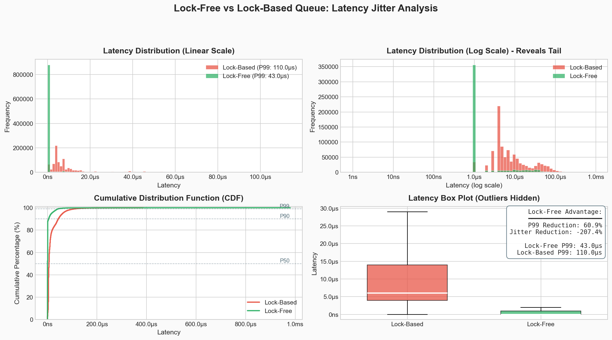

# Market Data Processor

A high-performance C++ trading engine simulation designed to benchmark and visualize the latency characteristics of **Lock-Based** (Mutex/CondVar) versus **Lock-Free** (Atomic Ring Buffer) queue architectures.


## Latency Analysis

This benchmark processes **1 million market ticks** to analyze the statistical distribution of **end-to-end latency**—the precise time from a tick's creation to its final processing.


> **Summary of Results:** The plot above compares processing latency between the two engines. The **Lock-Free** implementation (Green) maintains a tight, predictable cluster of low latency. In contrast, the **Lock-Based** implementation (Red) shows a "fat tail"—frequent, unpredictable spikes in processing time caused by thread contention and context switching.


### Key Metrics
* **Jitter (Coefficient of Variation):** Measures stability. The lock-free queue minimizes jitter, avoiding the unpredictable spikes common in lock-based systems.
* **P99 Latency:** Represents the worst-case speed for 99% of ticks. The lock-based queue exhibits a "fat tail" (high P99) caused by mutex contention and context switching.
## Features

* **Lock-Free Queue**: Custom SPSC (Single-Producer Single-Consumer) ring buffer using `std::atomic` with acquire/release memory ordering.
* **Lock-Based Queue**: Standard thread-safe implementation using `std::mutex` and `std::condition_variable`.
* **Market Simulator**: Generates synthetic market data (ticks) using Geometric Brownian Motion.
* **Benchmarking Suite**: 
    * End-to-end latency measurement.
    * Python visualization tools (Matplotlib/Pandas).
    * Google Benchmark integration for micro-benchmarks.

## Building

```bash
mkdir build && cd build
cmake ..
cmake --build .
````

## Running

### 1\. Run the Latency Benchmark

Run the simulation to generate latency data (`.csv`) for both implementations:

```bash
cd build
./queue_benchmark both
```

### 2\. Visualize Results

Generate the comparison plot (`data/latency_comparison.png`) using the provided Python script:

```bash
# Install dependencies
pip install -r scripts/requirements.txt

# Run visualizer
python3 scripts/visualize_latency.py
```

## Project Structure

  * `include/` - Header-only queue implementations and types.
  * `src/` - Simulation logic (MarketSim, SignalEngine).
  * `benchmarks/` - Latency and throughput benchmark executables.
  * `scripts/` - Python analysis and plotting tools.
  * `data/` - Stores benchmarking data
